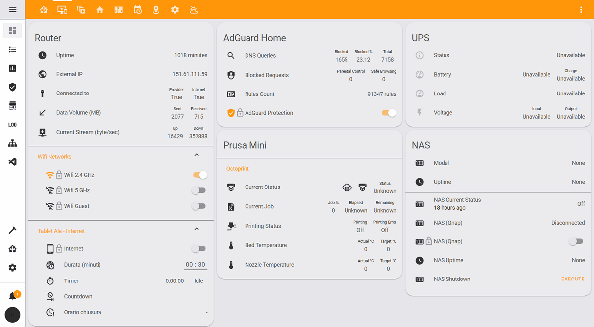
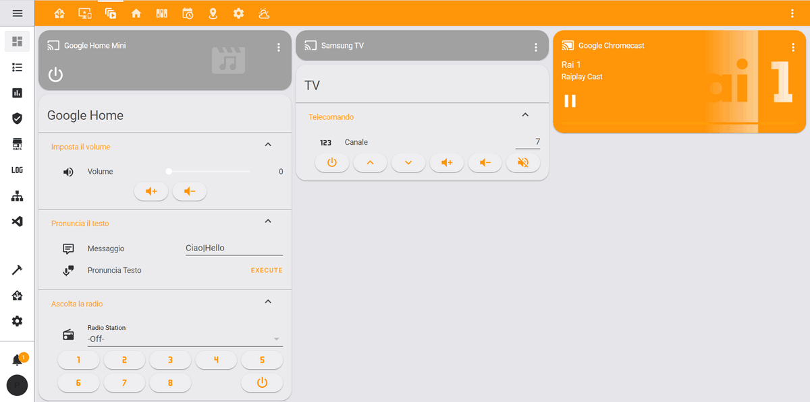
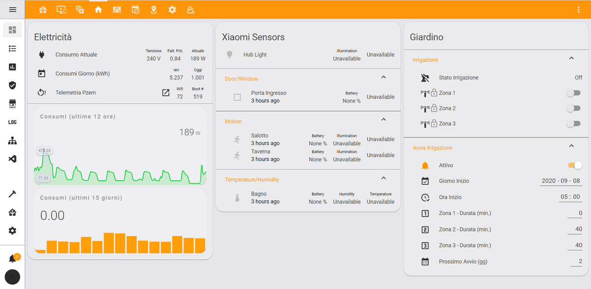
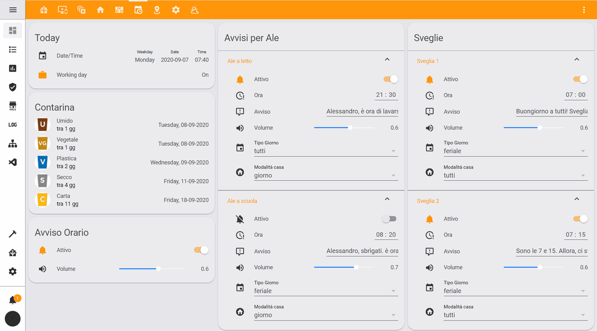
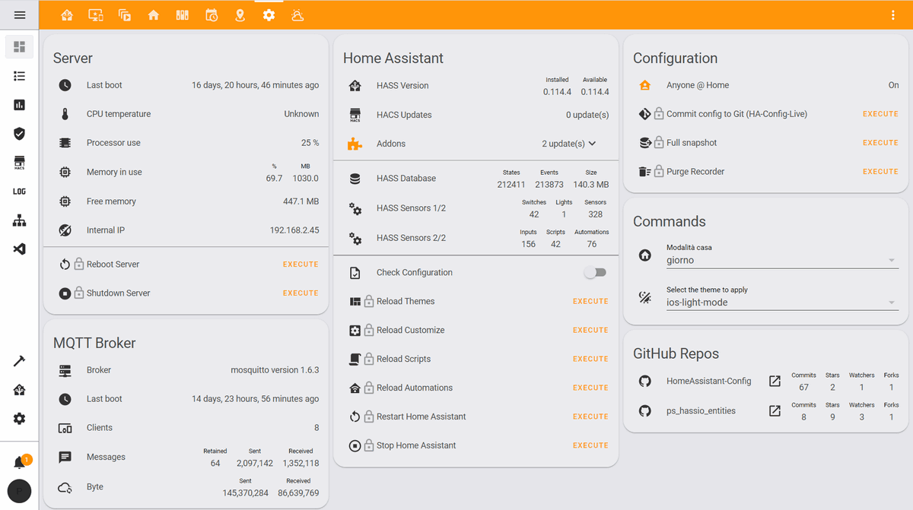
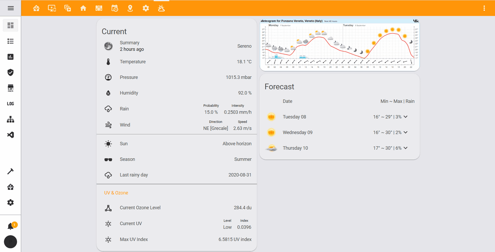

# Home Assistant Configuration

This repository contains my personal [Home Assistant](https://www.home-assistant.io) configuration and documentation.  
Feel free to :star: it if you find it somehow interesting or inspiring!

Btw the repo is automagically committed by an [Azure Pipeline](https://azure.microsoft.com/en-us/services/devops/pipelines), triggered after each push to my [Azure DevOps](https://azure.microsoft.com/en-us/services/devops) private repo, which takes care of applying some privacy adjustments before committing. :v:

***

## Lovelace Screenshots

Here some screenshots of my UI (some labels are in Italian, sorry :pray:).

### View 1 - Main

### View 2 - Devices

### View 3 - Media

### View 4 - Home

### View 5 - Switches

### View 6 - Events

### View 7 - Maps

### View 8 - System

### View 9 - Weather

***

## Additional Information

* [Connected Devices](devices.md)
* [Installed Addons](addons.md)
* [Node-Red Automations](node-red.md)

***

## To Do

* [ ] Better and more detailed documentation
* [ ] Include Node-Red flows & automations
