# About

These are the physical devices I currently use.

## My Devices

* **[Hosting & Networking](#hosting-networking)**
  * [Beelink X45](#beelink-x45)
  * [Raspberry Pi 3B](#raspberry-pi-3b)
  * [Fritz!Box 7530](#fritzbox-7530)
  * [Fritz!Repeater 1200](#fritzrepeater-1200)
  * [Qnap TS-251B](#qnap-ts-251b)
* **[Printers](#printers)**
  * [Epson WF-3620](#epson-wf-3620)
  * [Prusa Mini](#prusa-mini)
* **[Multimedia](#multimedia)**
  * [Samsung UE46ES7000](#samsung-ue46es7000)
  * [Google Home Mini](#google-home-mini)
  * [Google Chromecast](#google-chromecast)
* **[Smart Plugs / Switches](#smart-plugs-switches)**
  * [Sonoff 4CH Pro R2](#sonoff-4ch-pro-r2)
  * [Sonoff Dual](#sonoff-dual)
  * [Sonoff Basic](#sonoff-basic)
  * [Sonoff RE5V1C](#sonoff-re5v1c)
  * [Estink C178](#estink-c178)
  * [Zoozee SE131](#zoozee-se131)
  * [Klas Remo SWA11](#klas-remo-swa11)
* **[Home Monitoring](#home-monitoring)**
  * [Xiaomi Gateway](#xiaomi-gateway)
  * [Xiaomi Temperature and Humidity sensors](#xiaomi-temperature-and-humidity-sensors)
  * [Xiaomi Human Body sensors](#xiaomi-human-body-sensors)
  * [Xiaomi Door Window sensors](#xiaomi-window-door-sensors)
* **[IP Cameras](#ip-cameras)**
  * [YYZ100SS-XF+](#yyz100ss-xf)
  * [Sonoff GK-200MP2-B](#sonoff-gk-200mp2-b)
* **[Energy](#energy)**
  * [Tecnoware ERA PLUS STRIP 800](#tecnoware-era-plus-strip-800)
  * [PZEM-004T](#pzem-004t)
* **[Other](#other)**
  * [Landroid Wrox WR141E](#landroid-wrox-wr141e)

***

### Hosting & Networking

#### Beelink X45

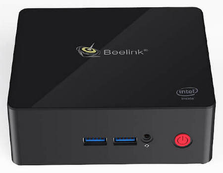

Mini PC: Intel Gemini Lake Celeron J4105, 8GB LPDDR4/128GB SSD, 2.4/5.8 G Wi-Fi, 4K, LAN 1000 Mbps, 2 x HDMI, BT 4.0.  
Proxmox VE installed as operating system.  
How many: 1

* <http://www.bee-link.com/portal.php?mod=view&aid=113>

#### Raspberry Pi 3B

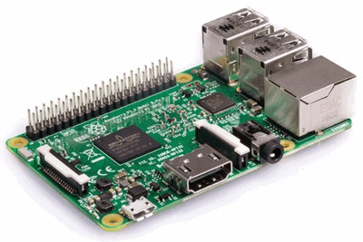

Single-board computer with wireless LAN and Bluetooth.  
How many: 1 (plus a 3B+ used for various projects)

* <https://www.raspberrypi.org/products/raspberry-pi-3-model-b>

#### Fritz!Box 7530

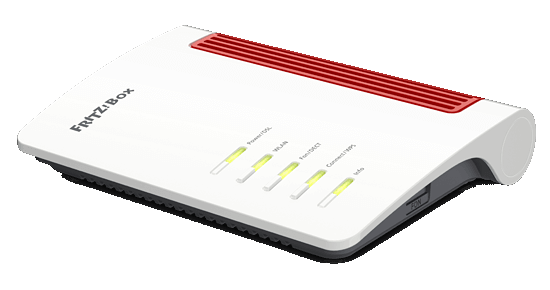

ADSL/VDSL modem router.  
How many: 1

* <https://en.avm.de/service/fritzbox/fritzbox-7530>

#### Fritz!Repeater 1200


Mesh WiFi repeater.  
How many: 1

* <https://en.avm.de/products/fritzwlan/fritzrepeater-1200>

#### Qnap TS-251B

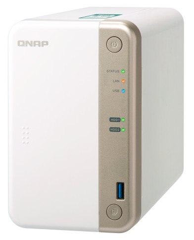

Home/SOHO Intel dual-core NAS.  
How many: 1

* <https://www.qnap.com/en-us/product/ts-251b>

***

### Printers

#### Epson WF-3620

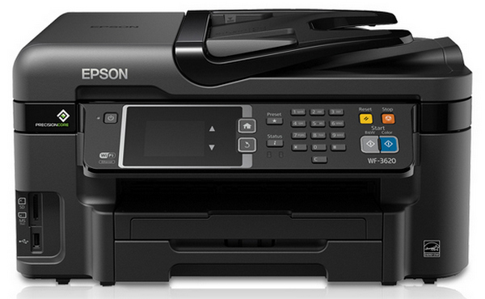

Epson WorkForce WF-3620 All-in-One Printer.  
Used mainly to scan documents.  
How many: 1

* <https://epson.com/For-Work/Printers/Inkjet/Epson-WorkForce-WF-3620-All-in-One-Printer/p/C11CD19201>

#### Prusa Mini

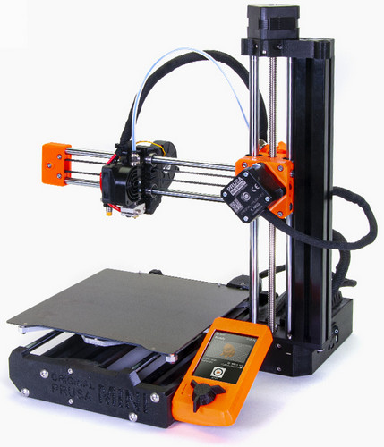

Prusa 3D compact printer.  
How many: 1

* <https://www.prusa3d.com/original-prusa-mini>

***

### Multimedia

#### Samsung UE46ES7000

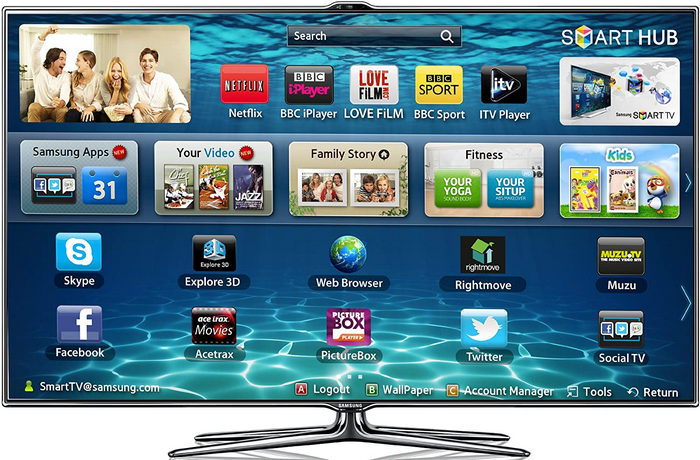

Samsung smart TV 47'.  
How many: 1

* <https://www.samsung.com/it/support/model/UE46ES7000QXZT>

#### Google Home Mini

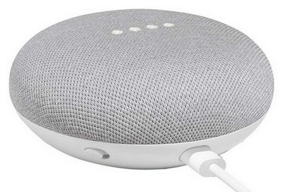

How many: 1

* <https://store.google.com/product/google_home_mini>

#### Google Chromecast

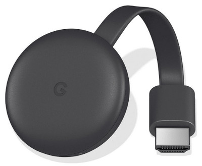

Google Chromecast (3rd generation).  
How many: 1

* <https://store.google.com/us/product/chromecast>

***

### Smart Plugs / Switches

#### Sonoff 4CH Pro R2

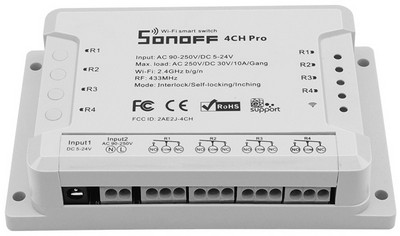

Smart switch, 4 channels (10A). Used for watering the garden.  
Flashed with [Tasmota](https://github.com/arendst/Sonoff-Tasmota).  
How many: 1

* <https://www.itead.cc/sonoff-4ch-pro.html>

#### Sonoff Dual

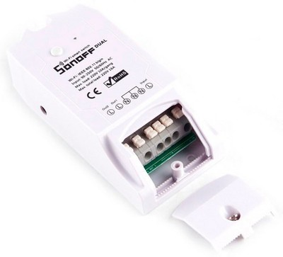

Smart switch, dual channel (10A). Used for shutter opening/closing.  
Flashed with [Tasmota](https://github.com/arendst/Sonoff-Tasmota).  
How many: 1

* <https://www.itead.cc/sonoff-dual.html>

#### Sonoff Basic

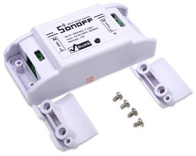

Smart switch, single channel (10A).  
Flashed with [Tasmota](https://github.com/arendst/Sonoff-Tasmota).  
How many: 3

* <https://www.itead.cc/sonoff-wifi-wireless-switch-1.html>

#### Sonoff RE5V1C

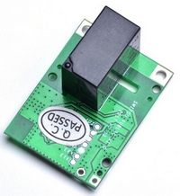

5V Wifi Inching/Selflock Relay Module (with Dry Contact)  
Flashed with [Tasmota](https://github.com/arendst/Sonoff-Tasmota).  
How many: 4

* <https://www.itead.cc/sonoff-re5v1c.html>

#### Estink C178

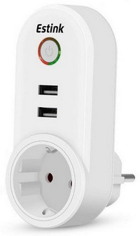

Smart plug (10A) with Schuko socket and 2 USB connections.  
Originally handled by Tuya / Smart Life apps.  
Flashed with [Tasmota](https://github.com/arendst/Sonoff-Tasmota) and [Tuya-Convert](https://github.com/ct-Open-Source/tuya-convert).  
How many: 2

* Tasmota Template

    ``` json
    {"NAME":"C178","GPIO":[0,0,0,0,52,57,0,0,21,17,0,0,0],"FLAG":0,"BASE":18}
    ```

#### Zoozee SE131

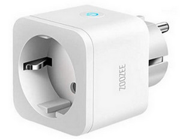

Smart plug (16A) with Schuko socket.  
Originally handled by Tuya / Smart Life apps.  
Flashed with [Tasmota](https://github.com/arendst/Sonoff-Tasmota) and [Tuya-Convert](https://github.com/ct-Open-Source/tuya-convert).  
How many: 2

* Tasmota Template

    ``` json
    {"NAME":"SE131","GPIO":[0,0,56,0,0,0,0,0,0,17,0,21,0],"FLAG":1,"BASE":18}
    ```

#### Klas Remo SWA11

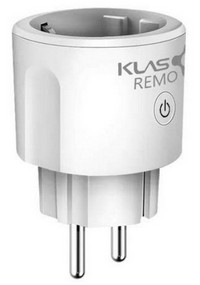

Smart plug (16A) with Schuko socket.  
Originally handled by Tuya / Smart Life apps.  
Flashed with [Tasmota](https://github.com/arendst/Sonoff-Tasmota) and [Tuya-Convert](https://github.com/ct-Open-Source/tuya-convert).  
                                      How many: 4

* Tasmota Template

    ``` json
    {"NAME":"SWA11","GPIO":[0,0,0,0,56,21,0,0,0,17,0,0,0],"FLAG":1,"BASE":18}
    ```

***

### Home Monitoring

#### Xiaomi Gateway

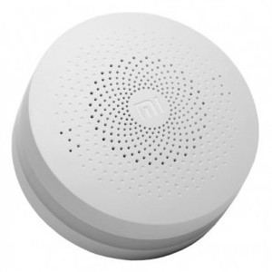

Xiaomi Mi Smart Home Gateway.  
Zigbee wireless hub for Xiaomi sensors and devices.  
How many: 1

* <https://xiaomi-mi.com/sockets-and-sensors/xiaomi-mi-gateway-2>

#### Xiaomi Temperature and Humidity sensors

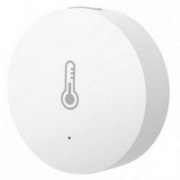

Zigbee sensor to detect temperature and humidity.  
How many: 1 (more soon...)

* <https://xiaomi-mi.com/sockets-and-sensors/xiaomi-mi-temperature-humidity-sensor>

#### Xiaomi Human Body sensors


Zigbee infrared motion sensor.  
How many: 2 (more soon...)

* <https://xiaomi-mi.com/sockets-and-sensors/xiaomi-mi-occupancy-sensor>

#### Xiaomi Door Window sensors

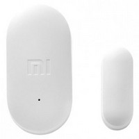

Zigbee sensor to detect opening/closing of doors and windows.  
How many: 1 (more soon...)

* <https://xiaomi-mi.com/sockets-and-sensors/xiaomi-mi-door-window-sensors>

***

### IP Cameras

#### YYZ100SS-XF+

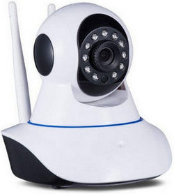

Wireless IP security camera.  
How many: 1

* <https://www.itead.cc/sonoff-gk-200mp2-b-wi-fi-wireless-ip-security-camera.html>

#### Sonoff GK-200MP2-B

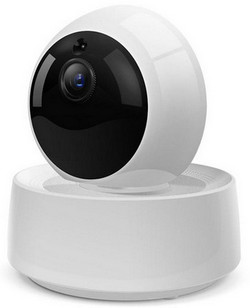

Wireless IP security camera.  
How many: 1 (more soon...)

* <https://www.itead.cc/sonoff-gk-200mp2-b-wi-fi-wireless-ip-security-camera.html>

***

### Energy

#### Tecnoware ERA PLUS STRIP 800

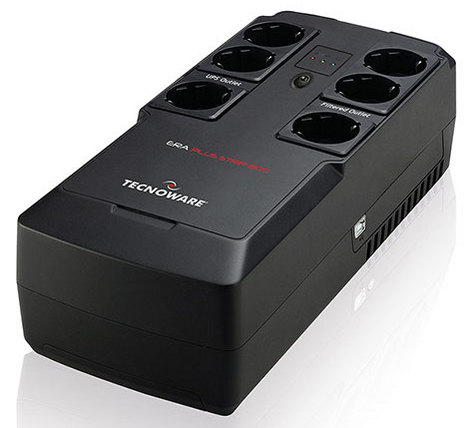

UPS Line interactive 800VA/560W.  
How many: 1

* <https://www.tecnoware.com/en-US/Prodotti/FGCERAPLST800/ups-era-plus-strip-800.aspx>

#### PZEM-004T

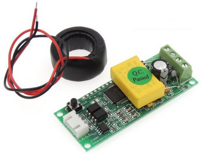

DIY device for monitoring of house energy consumption.  
Built with a Wemos D1, flashed with [Tasmota](https://github.com/arendst/Sonoff-Tasmota).  
How many: 1

***

### Other

#### Landroid Wrox WR141E


Robotic lawn mower for gardens up to 500 m2.
How many: 1

* <https://www.worx-uk.com/shop/landroid-2019-en/worx-20v-robot-mower-landroid-m500-wr141e>

***
