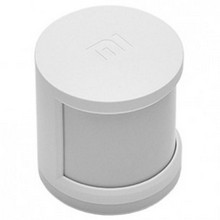

# About

These are the physical devices currently in use.

## Devices

* **[Hosting & Networking](#hosting-networking)**
  * [Raspberry Pi 3B](#raspberry-pi-3b)
  * [Fritz!Box 3390](#fritzbox-3390)
  * [Qnap TS-251B](#qnap-ts-251b)
* **[Printers](#printers)**
  * [Epson WF-3620](#epson-wf-3620)
  * [Prusa Mini](#prusa-mini)
* **[Multimedia](#multimedia)**
  * [Samsung UE46ES7000](#samsung-ue46es7000)
  * [Google Home Mini](#google-home-mini)
  * [Google Chromecast](#google-chromecast)
* **[Smart Plugs / Switches](#smart-plugs-switches)**
  * [Sonoff 4CH Pro R2](#sonoff-4ch-pro-r2)
  * [Sonoff Dual](#sonoff-dual)
  * [Sonoff Basic](#sonoff-basic)
  * [Estink C178](#estink-c178)
  * [Zoozee SE131](#zoozee-se131)
  * [Klas Remo SWA11](#klas-remo-swa11)
* **[Home Monitoring](#home-monitoring)**
  * [Xiaomi Gateway](#xiaomi-gateway)
  * [Xiaomi Temperature and Humidity sensors](#xiaomi-temperature-and-humidity-sensors)
  * [Xiaomi Human Body sensors](#xiaomi-human-body-sensors)
  * [Xiaomi Door Window sensors](#xiaomi-window-door-sensors)
  * [Sonoff GK-200MP2-B](#sonoff-gk-200mp2-b)
* **[Energy](#energy)**
  * [Tecnoware ERA PLUS STRIP 800](#tecnoware-era-plus-strip-800)
  * [PZEM-004T](#pzem-004t)

***

### Hosting & Networking

#### Raspberry Pi 3B


Single-board computer with wireless LAN and Bluetooth.  
How many: 1 (plus a 3B+ used for various projects)

* <https://www.raspberrypi.org/products/raspberry-pi-3-model-b>

#### Fritz!Box 3390


ADSL modem router.  
How many: 1

* <https://en.avm.de/service/fritzbox/fritzbox-3390>

#### Qnap TS-251B


Home/SOHO Intel dual-core NAS.  
How many: 1

* <https://www.qnap.com/en-us/product/ts-251b>

***

### Printers

#### Epson WF-3620


Epson WorkForce WF-3620 All-in-One Printer.  
Used mainly to scan documents.  
How many: 1

* <https://epson.com/For-Work/Printers/Inkjet/Epson-WorkForce-WF-3620-All-in-One-Printer/p/C11CD19201>

#### Prusa Mini


Prusa 3D compact printer.  
How many: 1

* <https://www.prusa3d.com/original-prusa-mini>

***

### Multimedia

#### Samsung UE46ES7000


Samsung smart TV 47'.  
How many: 1

* <https://www.samsung.com/it/support/model/UE46ES7000QXZT>

#### Google Home Mini


How many: 1

* <https://store.google.com/product/google_home_mini>

#### Google Chromecast


Google Chromecast (3rd generation).  
How many: 1

* <https://store.google.com/us/product/chromecast>

***

### Smart Plugs / Switches

#### Sonoff 4CH Pro R2


Smart switch, 4 channels (10A). Used for watering the garden.  
Flashed with [Tasmota](https://github.com/arendst/Sonoff-Tasmota).  
How many: 1

* <https://www.itead.cc/sonoff-4ch-pro.html>

#### Sonoff Dual


Smart switch, dual channel (10A). Used for shutter opening/closing.  
Flashed with [Tasmota](https://github.com/arendst/Sonoff-Tasmota).  
How many: 1

* <https://www.itead.cc/sonoff-dual.html>

#### Sonoff Basic


Smart switch, single channel (10A).  
Flashed with [Tasmota](https://github.com/arendst/Sonoff-Tasmota).  
How many: 3

* <https://www.itead.cc/sonoff-wifi-wireless-switch-1.html>

#### Estink C178


Smart plug (10A) with Schuko socket and 2 USB connections.  
Originally handled by Tuya / Smart Life apps.  
Flashed with [Tasmota](https://github.com/arendst/Sonoff-Tasmota) and [Tuya-Convert](https://github.com/ct-Open-Source/tuya-convert).  
How many: 2

* Tasmota Template

    ``` json
    {"NAME":"C178","GPIO":[0,0,0,0,52,57,0,0,21,17,0,0,0],"FLAG":0,"BASE":18}
    ```

#### Zoozee SE131


Smart plug (16A) with Schuko socket.  
Originally handled by Tuya / Smart Life apps.  
Flashed with [Tasmota](https://github.com/arendst/Sonoff-Tasmota) and [Tuya-Convert](https://github.com/ct-Open-Source/tuya-convert).  
How many: 2

* Tasmota Template

    ``` json
    {"NAME":"SE131","GPIO":[0,0,56,0,0,0,0,0,0,17,0,21,0],"FLAG":1,"BASE":18}
    ```

#### Klas Remo SWA11


Smart plug (16A) with Schuko socket.  
Originally handled by Tuya / Smart Life apps.  
Flashed with [Tasmota](https://github.com/arendst/Sonoff-Tasmota) and [Tuya-Convert](https://github.com/ct-Open-Source/tuya-convert).  
How many: 4

* Tasmota Template

    ``` json
    {"NAME":"SWA11","GPIO":[0,0,0,0,56,21,0,0,0,17,0,0,0],"FLAG":1,"BASE":18}
    ```

***

### Home Monitoring

#### Xiaomi Gateway


Xiaomi Mi Smart Home Gateway.  
Zigbee wireless hub for Xiaomi sensors and devices.  
How many: 1

* <https://xiaomi-mi.com/sockets-and-sensors/xiaomi-mi-gateway-2>

#### Xiaomi Temperature and Humidity sensors


Zigbee sensor to detect temperature and humidity.  
How many: 1 (more soon...)

* <https://xiaomi-mi.com/sockets-and-sensors/xiaomi-mi-temperature-humidity-sensor>

#### Xiaomi Human Body sensors



Zigbee infrared motion sensor.  
How many: 2 (more soon...)

* <https://xiaomi-mi.com/sockets-and-sensors/xiaomi-mi-occupancy-sensor>

#### Xiaomi Door Window sensors


Zigbee sensor to detect opening/closing of doors and windows.  
How many: 1 (more soon...)

* <https://xiaomi-mi.com/sockets-and-sensors/xiaomi-mi-door-window-sensors>

#### Sonoff GK-200MP2-B


Wireless IP security camera.  
How many: 1 (more soon...)

* <https://www.itead.cc/sonoff-gk-200mp2-b-wi-fi-wireless-ip-security-camera.html>

***

### Energy

#### Tecnoware ERA PLUS STRIP 800


UPS Line interactive 800VA/560W.  
How many: 1

* <https://www.tecnoware.com/en-US/Prodotti/FGCERAPLST800/ups-era-plus-strip-800.aspx>

#### PZEM-004T


DIY device for monitoring of house energy consumption.  
Built with a Wemos D1, flashed with [Tasmota](https://github.com/arendst/Sonoff-Tasmota).  
How many: 1

***
