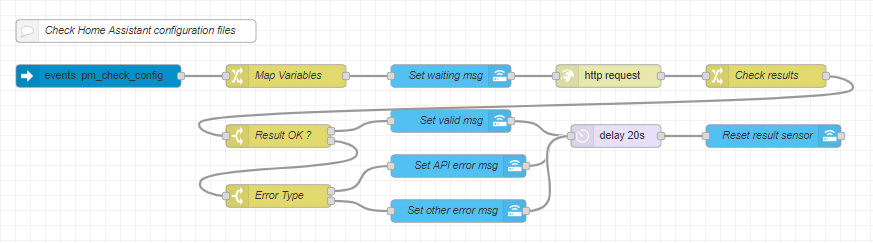

# Check Home Assistant Configuration Files

This flow handles the process of checking the Home Assistant configuration files.  
It also shows the result and errors (if any) in the UI via a custom sensor.

***

## Node-Red



``` json
[{"id":"f8b72824.980bb8","type":"http request","z":"4bccd3e3.8577cc","name":"","method":"POST","ret":"obj","paytoqs":false,"url":"http://hassio.local:8123/api/config/core/check_config","tls":"","persist":false,"proxy":"","authType":"bearer","x":830,"y":420,"wires":[["b191d9cf.355958"]]},{"id":"dc136478.f3ead8","type":"comment","z":"4bccd3e3.8577cc","name":"Check Home Assistant configuration files","info":"","x":200,"y":360,"wires":[]},{"id":"7b3262bf.b1469c","type":"api-call-service","z":"4bccd3e3.8577cc","name":"Set valid msg","server":"20e9de74.7a8332","version":1,"debugenabled":false,"service_domain":"python_script","service":"hass_entities","entityId":"","data":"{\"action\":\"set_state_attributes\",\"entity_id\":\"sensor.hass_config_check_result\",\"state\":\"{{{ha_msg_valid}}}\",\"attributes\":[{\"icon\":\"{{{ha_icon_valid}}}\"},{\"error\":\"{{{ha_error_default}}}\"},{\"error_type\":\"{{{ha_error_type_default}}}\"},{\"last_checked\":\"{{{ha_last_checked}}}\"}],\"log_enabled\":\"false\"}","dataType":"json","mergecontext":"","output_location":"","output_location_type":"none","mustacheAltTags":false,"x":620,"y":480,"wires":[["636252f8.c7755c"]]},{"id":"c8b548df.5f85d8","type":"switch","z":"4bccd3e3.8577cc","name":"Result OK ?","property":"payload.result","propertyType":"msg","rules":[{"t":"eq","v":"valid","vt":"str"},{"t":"else"}],"checkall":"false","repair":false,"outputs":2,"x":390,"y":500,"wires":[["7b3262bf.b1469c"],["67c44bbd.f04fd4"]],"outputLabels":["Yes","No"]},{"id":"4cdc1fff.69fcb","type":"api-call-service","z":"4bccd3e3.8577cc","name":"Set waiting msg","server":"20e9de74.7a8332","version":1,"debugenabled":false,"service_domain":"python_script","service":"hass_entities","entityId":"","data":"{\"action\":\"set_state_attributes\",\"entity_id\":\"sensor.hass_config_check_result\",\"state\":\"{{{ha_msg_checking}}}\",\"attributes\":[{\"icon\":\"{{{ha_icon_checking}}}\"},{\"error\":\"{{{ha_error_default}}}\"},{\"error_type\":\"{{{ha_error_type_default}}}\"},{\"last_checked\":\"{{{ha_last_checked_default}}}\"}],\"log_enabled\":\"false\"}","dataType":"json","mergecontext":"","output_location":"","output_location_type":"none","mustacheAltTags":false,"x":620,"y":420,"wires":[["f8b72824.980bb8"]]},{"id":"c03ae688.e7ac28","type":"api-call-service","z":"4bccd3e3.8577cc","name":"Reset result sensor","server":"20e9de74.7a8332","version":1,"debugenabled":false,"service_domain":"python_script","service":"hass_entities","entityId":"","data":"{\"action\":\"set_state_attributes\",\"entity_id\":\"sensor.hass_config_check_result\",\"state\":\"{{{ha_msg_default}}}\",\"attributes\":[{\"icon\":\"{{{ha_icon_default}}}\"},{\"error\":\"{{{ha_error_default}}}\"},{\"error_type\":\"{{{ha_error_type_default}}}\"},{\"last_checked\":\"{{{ha_last_checked_default}}}\"}],\"log_enabled\":\"false\"}","dataType":"json","mergecontext":"","output_location":"","output_location_type":"none","mustacheAltTags":false,"x":1050,"y":500,"wires":[[]]},{"id":"b0d3f29f.e93e1","type":"api-call-service","z":"4bccd3e3.8577cc","name":"Set API error msg","server":"20e9de74.7a8332","version":1,"debugenabled":false,"service_domain":"python_script","service":"hass_entities","entityId":"","data":"{\"action\":\"set_state_attributes\",\"entity_id\":\"sensor.hass_config_check_result\",\"state\":\"{{{ha_msg_invalid}}}\",\"attributes\":[{\"icon\":\"{{{ha_icon_invalid}}}\"},{\"error\":\"{{{payload.errors}}}\"},{\"error_type\":\"From API\"},{\"last_checked\":\"{{{ha_last_checked}}}\"}],\"log_enabled\":\"false\"}","dataType":"json","mergecontext":"","output_location":"","output_location_type":"none","mustacheAltTags":false,"x":630,"y":540,"wires":[["636252f8.c7755c"]]},{"id":"636252f8.c7755c","type":"delay","z":"4bccd3e3.8577cc","name":"","pauseType":"delay","timeout":"20","timeoutUnits":"seconds","rate":"1","nbRateUnits":"1","rateUnits":"second","randomFirst":"1","randomLast":"5","randomUnits":"seconds","drop":false,"x":840,"y":500,"wires":[["c03ae688.e7ac28"]]},{"id":"b35988c2.1d2938","type":"change","z":"4bccd3e3.8577cc","name":"Map Variables","rules":[{"t":"set","p":"ha_msg_default","pt":"msg","to":" ","tot":"str"},{"t":"set","p":"ha_msg_checking","pt":"msg","to":"Checking Config...","tot":"str"},{"t":"set","p":"ha_msg_valid","pt":"msg","to":"Valid","tot":"str"},{"t":"set","p":"ha_msg_invalid","pt":"msg","to":"Errors","tot":"str"},{"t":"set","p":"ha_icon_default","pt":"msg","to":"mdi:file-check-outline","tot":"str"},{"t":"set","p":"ha_icon_checking","pt":"msg","to":"mdi:timer-sand","tot":"str"},{"t":"set","p":"ha_icon_valid","pt":"msg","to":"mdi:emoticon-cool-outline","tot":"str"},{"t":"set","p":"ha_icon_invalid","pt":"msg","to":"mdi:emoticon-dead-outline","tot":"str"},{"t":"set","p":"ha_error_default","pt":"msg","to":"None","tot":"str"},{"t":"set","p":"ha_error_type_default","pt":"msg","to":"None","tot":"str"},{"t":"set","p":"ha_last_checked_default","pt":"msg","to":"-","tot":"str"}],"action":"","property":"","from":"","to":"","reg":false,"x":400,"y":420,"wires":[["4cdc1fff.69fcb"]]},{"id":"1874eb91.863e44","type":"server-events","z":"4bccd3e3.8577cc","name":"","server":"20e9de74.7a8332","event_type":"pm_check_config","exposeToHomeAssistant":false,"haConfig":[{"property":"name","value":""},{"property":"icon","value":""}],"x":150,"y":420,"wires":[["b35988c2.1d2938"]]},{"id":"67c44bbd.f04fd4","type":"switch","z":"4bccd3e3.8577cc","name":"Error Type","property":"payload.errors","propertyType":"msg","rules":[{"t":"nnull"},{"t":"else"}],"checkall":"false","repair":false,"outputs":2,"x":390,"y":580,"wires":[["b0d3f29f.e93e1"],["e9f80bfa.398668"]],"outputLabels":["API Error","Unattended Erro"]},{"id":"e9f80bfa.398668","type":"api-call-service","z":"4bccd3e3.8577cc","name":"Set other error msg","server":"20e9de74.7a8332","version":1,"debugenabled":false,"service_domain":"python_script","service":"hass_entities","entityId":"","data":"{\"action\":\"set_state_attributes\",\"entity_id\":\"sensor.hass_config_check_result\",\"state\":\"{{{ha_msg_invalid}}}\",\"attributes\":[{\"icon\":\"{{{ha_icon_invalid}}}\"},{\"error\":\"{{{payload}}}\"},{\"error_type\":\"Unattended\"},{\"last_checked\":\"{{{ha_last_checked}}}\"}],\"log_enabled\":\"false\"}","dataType":"json","mergecontext":"","output_location":"","output_location_type":"none","mustacheAltTags":false,"x":630,"y":600,"wires":[["636252f8.c7755c"]]},{"id":"b191d9cf.355958","type":"change","z":"4bccd3e3.8577cc","name":"Check results","rules":[{"t":"set","p":"payload.errors","pt":"msg","to":"$replace($string(payload.errors), '\\n', ' -- ')\t","tot":"jsonata"},{"t":"set","p":"payload.errors","pt":"msg","to":"$replace($string(payload.errors), '\"', \"'\")","tot":"jsonata"},{"t":"set","p":"ha_last_checked","pt":"msg","to":"$now()","tot":"jsonata"}],"action":"","property":"","from":"","to":"","reg":false,"x":1040,"y":420,"wires":[["c8b548df.5f85d8"]]},{"id":"20e9de74.7a8332","type":"server","z":"","name":"Home Assistant","legacy":false,"addon":true,"rejectUnauthorizedCerts":true,"ha_boolean":"y|yes|true|on|home|open","connectionDelay":true}]
```

***

## Home Assistant

TODO Put HA yaml & image here

***

## Dependencies

### Node-Red Packages

* [TODO](https://adguard.com)

### Home Assistant Components

* [ps_hassio_entities](https://github.com/pmazz/ps_hassio_entities)
